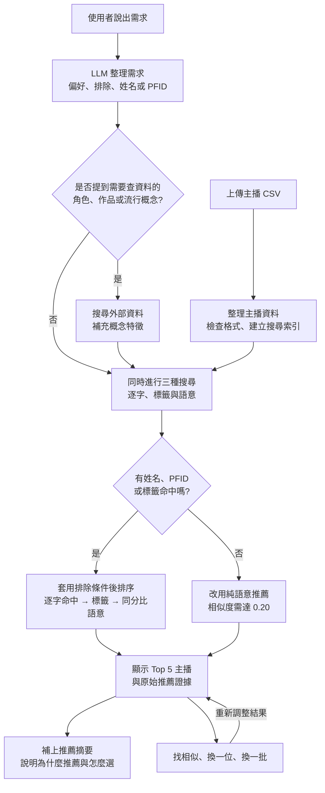
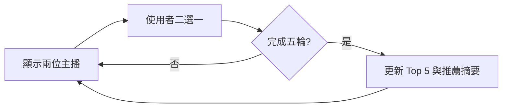

# 主播推薦助理

以 131 位主播 metadata 實作的對話式推薦 Demo，對應 take-home assignment 的「主播推薦系統」。使用者可用自然語言描述偏好、排除特徵，或輸入主播姓名、帳號與 PFID；系統會以標籤、逐字搜尋和 Embedding 排出 Top 5，並使用原始 `reasons` 佐證推薦結果。作品、角色、遊戲或流行語可透過受控 Web Search 補充語意特徵。

選擇此題是因為資料同時具有多值標籤，以及 `overall_vibe`、`self_description`、`reasons` 等敘述文字，適合展示 Hybrid Retrieval、可解釋排序與 grounded generation。

## 設計理念

### 聊天推薦：明確條件優先，語意負責補充

- **Hybrid Retrieval**：人名與 PFID 使用逐字搜尋，明確偏好使用標籤加權；
  Embedding 只處理同分與純語意 fallback，不推翻較高的標籤分數。
- **先推薦、再校正**：不要求先完成問卷或補齊所有欄位。只要目前 State
  已有可用條件，就先顯示結果，再透過後續對話新增、修改或取消偏好。
- **可操作的 Feedback loop**：使用者能以喜歡的主播作為「找相似」基準，
  或使用「換一位／換一批」，形成「快速推薦 → 選擇 → 調整 → 再推薦」。
- **先顯示結果**：排名完成後先渲染 Top 5，較慢的摘要稍後填回；摘要失敗
  也不阻擋推薦卡片。
- **Grounded LLM**：LLM 負責理解輸入與整理摘要，程式負責候選與排名；
  Web Search 只補充 query，推薦證據仍取自 `reasons` 與 metadata。

### Pairwise Explorer：讓難以描述的偏好從選擇中浮現

- **降低表達門檻**：適合「看到人能選，但很難先說出偏好」的使用者；
  每輪只需二選一，不必輸入完整需求。
- **累積弱偏好**：比較勝者與敗者的差異標籤，每五輪更新一次 Top 5，
  不把單次選擇直接視為永久偏好。
- **獨立實驗**：定位為 Experimental Prototype，不是聊天推薦的 Feedback，
  也不修改聊天 Preference State，方便比較兩種互動模式。

### 設計對應的互動範例

| 情境 | 使用者操作 | 系統行為 |
| --- | --- | --- |
| 快速開始 | `想找會唱歌的主播` | 立即推薦，不追問未指定欄位 |
| 多輪校正 | 接著說 `希望更有陪伴感` | 保留歌唱偏好，加入陪伴感並更新 Top 5 |
| 身分搜尋 | `Eason Lee` 或 `4475935` | 逐字搜尋人名或 PFID，身分命中優先 |
| 外部概念 | `想找像芙莉蓮的主播` | 必要時用 Web Search 補充 query，再做語意搜尋 |
| 結果調整 | 點擊 `找相似` 或 `換一位` | 使用快取分數更新結果，不寫入永久偏好 |
| Pairwise 探索 | 每輪選擇較喜歡的一位 | 累積弱偏好，每五輪更新實驗性 Top 5 |

## 系統流程

### 聊天推薦流程



### Pairwise Explorer 流程



## 快速執行

### 線上 Demo

[開啟 Streamlit Community Cloud Demo](https://zzzpatr-streamer-recommend-app-plmn8c.streamlit.app/)

開啟後可直接上傳題目提供的 `anchors_100.csv` 並開始使用。為避免公開面試
附件，原始 CSV 與 `take-home-assignment.pdf` 均未提交至公開 GitHub；線上
Demo 也不預載這兩份檔案。

### 本機執行

建議使用 Python 3.12：

```powershell
python -m venv .venv
.\.venv\Scripts\Activate.ps1
pip install -r requirements.txt
$env:OPENAI_API_KEY="your-api-key"
streamlit run app.py
```

執行測試：

```powershell
python -m unittest discover -v -p "test_*.py"
```

也可將 API Key 寫入 `.streamlit/secrets.toml`：

```toml
OPENAI_API_KEY = "your-api-key"
```

開啟頁面後同樣需要上傳 `anchors_100.csv`。若沒有 API Key，Pairwise 排名
仍可使用，但聊天推薦與 LLM 摘要需要 API。

## 1. Input

目前支援兩種入口。

### 偏好推薦

使用自然語言描述想要或不想要的條件：

```text
我想找會唱歌、親切友善的男主播
想找像朋友一樣陪伴、讓人放鬆的主播
想找像芙莉蓮一樣的主播
不要互動太熱絡，偏好音樂陪伴
改成性別不限，但保留歌唱偏好
```

支援多輪新增、修改、取消與排除偏好。未修改的 State 會保留至後續對話。

### 主播身分搜尋

姓名、暱稱、社群帳號與 PFID 使用本地逐字搜尋：

```text
名字是 Eason Lee
4475935
PFID 是 4475935
```

搜尋不分英文大小寫並支援子字串。純數字輸入一律先視為 PFID；目前不支援錯字修正、fuzzy matching 或同名消歧。

## 2. Data Prepared

使用者在 Streamlit 上傳 CSV，必要欄位如下：

| 欄位 | 用途 |
| --- | --- |
| `pfid` | 主播唯一 ID 與身分搜尋 |
| `gender` | 性別軟偏好 |
| `personality` | 性格定位 |
| `appearance` | 外型特徵 |
| `talents` | 才藝 |
| `featured_topics` | 直播主題 |
| `live_streaming_style` | 直播互動與內容風格 |
| `overall_vibe` | 語意搜尋與摘要比較 |
| `reasons` | 標籤的 JSON 原始證據 |
| `self_description` | 語意搜尋、身分搜尋與摘要比較 |

處理流程：

1. 驗證必要欄位、空白 `pfid` 與重複 `pfid`。
2. 將頓號、半形／全形逗號與分號分隔的多值欄位正規化。
3. 建立 `field → value → pfid set` 記憶體倒排索引。
4. 將每位主播的結構化欄位、整體氛圍、自我介紹和 `reasons` 組成語意文件。
5. 使用 `text-embedding-3-small` 建立主播向量並保存在目前 Session 記憶體。

`reasons` key 的主要格式：

```text
男性／女性
純真可愛型
外型_可愛甜美
才藝_歌唱
主題_日常輕鬆閒聊
風格_互動熱絡
```

性別欄位的 `男／女` 會對應到 reason key 的 `男性／女性`。其他欄位優先查找「中文前綴_標籤值」，找不到時再以純標籤值 fallback；原始資料沒有證據時不生成理由。

線上 Demo 不需預先執行 `prepare_data.py` 或 `vector_search.py --build`，兩者僅保留為本機離線分析工具。

## 3. LLM Structure

`gpt-5.6-luna` 不直接決定推薦誰，只負責將每輪訊息更新為完整 Preference
State，並在排名完成後整理摘要：

```json
{
  "assistant_message": "已更新你的主播偏好。",
  "preferences": {
    "gender": ["男"],
    "personality": [],
    "appearance": [],
    "talents": ["歌唱"],
    "featured_topics": [],
    "live_streaming_style": ["親切友善"]
  },
  "excluded_preferences": {
    "gender": [],
    "personality": [],
    "appearance": [],
    "talents": [],
    "featured_topics": [],
    "live_streaming_style": []
  },
  "semantic_query": "像朋友一樣陪伴",
  "literal_queries": ["Eason Lee"],
  "web_lookup_query": "芙莉蓮 動漫角色 性格 特質"
}
```

分流規則：

```text
能映射的標準標籤       → preferences
明確不要的標準標籤     → excluded_preferences
抽象感受、作品或角色概念 → semantic_query
主播姓名、帳號、PFID    → literal_queries
需外部知識的明確實體    → web_lookup_query
```

格式由 Pydantic Structured Outputs 約束。LLM 回傳後：

- `sanitize_preferences()` 只保留目前 CSV 倒排索引中存在的標籤。
- `sanitize_literal_queries()` 移除空白與重複值，最多保留 10 筆。
- `previous_response_id` 與目前完整 State 用來延續多輪對話。
- `web_lookup_query` 只反映最新一輪，不會累積進 State；普通形容詞、標準標籤、主播姓名、PFID 與用途不明的普通名詞不會觸發搜尋。

## 4. Reasoning

系統採用逐字搜尋、倒排索引與 Embedding 的 Hybrid Retrieval。

### 4.1 身分逐字搜尋

`literal_queries` 只搜尋：

```text
pfid
self_description
```

逐字命中代表使用者正在尋找特定主播，因此排序優先於一般偏好分數。

例如：

| 使用者輸入 | LLM 結構化結果 | 搜尋方式 |
| --- | --- | --- |
| `找 Eason Lee` | `literal_queries=["Eason Lee"]` | 在 `self_description` 搜尋人名 |
| `IG 是 eason_live` | `literal_queries=["eason_live"]` | 在 `self_description` 搜尋社群帳號文字 |
| `4475935` | `literal_queries=["4475935"]` | 純數字直接視為 PFID，搜尋 `pfid` |
| `PFID 是 4475935` | `literal_queries=["4475935"]` | 搜尋明確指定的 `pfid` |

目前 CSV 沒有獨立的 IG 或社群帳號欄位，因此帳號必須已出現在
`self_description` 才能命中。逐字搜尋不支援錯字修正；若輸入的人名或帳號
不存在，系統會保留查詢條件，但不會產生逐字候選。

### 4.2 標籤加權

所有正向條件包含性別，都是軟偏好：

| 欄位 | 原始權重 |
| --- | ---: |
| 性別 | 0.25 |
| 性格 | 0.15 |
| 外型 | 0.15 |
| 才藝 | 0.15 |
| 直播主題 | 0.15 |
| 直播風格 | 0.15 |

只針對實際啟用欄位重新正規化：

```text
normalized_weight(field) = field_weight / sum(active_field_weights)
score_per_tag = normalized_weight(field) / number_of_values_in_field
tag_score = sum(score_per_tag for matched tags)
```

同欄位多個值會平均分配該欄位權重。`excluded_preferences` 是硬排除，命中任一排除標籤即移除候選。

### 4.3 受控 Web query expansion

若最新訊息明確包含需要外部知識才能理解的作品、角色、IP、遊戲或流行語，系統才會額外呼叫 Responses API：

```python
tools=[{"type": "web_search"}]
```

Web Search 將實體整理成人格、互動方式、內容主題、才藝、視覺風格或整體氛圍等短特徵。結果只與原始 `semantic_query` 合併後送進 Embedding，不會寫入 `preferences`、修改主播 metadata 或直接決定候選。相同 lookup query 在目前 Session 中會快取；搜尋失敗或內容不明確時退回原始語意查詢。

介面會在語意補充旁顯示最多三個可點擊來源。外部來源僅用於理解使用者所指的概念，主播事實與推薦證據仍只取自上傳 CSV。

### 4.4 語意分數

結構化偏好與 `semantic_query` 會組成完整查詢並建立 query vector：

```text
vector_score = clip(normalized_streamer_vector · normalized_query_vector, 0, 1)
```

這是 cosine similarity，不是命中機率。

### 4.5 最終排名

```text
優先序如下
逐字搜尋分數（literal_score）DESC
標籤匹配分數（tag_score）DESC
語意相似分數（vector_score）DESC
主播識別碼（pfid）ASC
```

- `tag_score` 相同時，`vector_score` 作為 tie-breaker。
- `tag_score` 不同時，語意分數不能推翻較高的標籤分數。
- 沒有逐字或標籤候選時，純語意結果需達 `0.20` 門檻。
- 向量搜尋不會補滿不足 Top 5 的標籤結果。
- `pfid` 只用於最後的穩定排序，不代表主播品質。

結構化標籤負責主要排序，Embedding 負責同分辨識與純語意 fallback；前面的
互動範例表呈現了各種輸入如何進入這些路徑。

## 5. Output

Streamlit 會顯示：

- Sidebar 中目前累積的正向偏好、排除偏好、語意偏好、Web 概念補充與逐字搜尋。
- Top 5 固定等高的直式主播卡片；內容超出時在卡片內捲動，避免自我介紹長短影響版面。
- 匹配度、推薦來源、命中標籤與語意相似度。
- 才藝、直播主題、直播風格、整體氛圍與截短的主播自我介紹。
- 可展開的 `reasons` 原始推薦證據。
- 「為什麼推薦」及「五位怎麼選」兩段式 LLM 摘要。
- 每張聊天推薦卡片的「找相似／換一位」，以及整組「換一批」。

### 推薦摘要

推薦排名完成後會先渲染五張主播卡片，再呼叫 LLM 產生摘要，完成後填回卡片上方的預留位置。

摘要 context 包含：

- 目前偏好與查詢。
- 候選分數、命中標籤及逐字命中。
- 若由「找相似」或更新組合產生，包含對應的結果來源與基準 PFID。
- 每位主播最多兩筆 `reason_evidence`。
- 由 `overall_vibe` 和前 200 字 `self_description` 組成的 `comparison_text`。

摘要使用兩欄 Structured Output，Streamlit 分別渲染，避免依賴 `<br>` 或 Markdown 空行：

```json
{
  "recommendation_reason": "為什麼推薦這批主播。",
  "selection_guide": "五位主播可以怎麼選。"
}
```

`self_description` 屬於主播自述，不等同已驗證事實；`reasons` 是標籤命中的主要證據。摘要 API 失敗時改用規則式 fallback，不影響已完成的推薦卡片。

## 6. Feedback

聊天頁提供立即影響結果的操作，不要求使用者額外標註偏好：

| 操作 | 行為 |
| --- | --- |
| `換一位` | 本次查詢略過該 PFID，以原排名的下一順位補上 |
| `換一批` | 略過目前五位，顯示下一組候選 |
| `找相似` | 保留所選主播作為向量基準，顯示該主播與四位相似主播 |
| `恢復原推薦` | 清除本次略過清單與相似基準，回到原始排序 |

`換一位` 和 `換一批` 只更新 Session 內的 `dismissed_pfids`，不推測負向特徵，也不修改 Preference State。輸入新的聊天訊息時會清除本次略過狀態。

`找相似` 直接取所選主播已建立的向量，與全部主播向量計算 cosine similarity；因此會一起參考結構化欄位、`overall_vibe`、`self_description` 與 `reasons`，不需要重新呼叫 Embedding API。明確的 `excluded_preferences` 仍會套用，但原本正向條件不會壓過相似度排序。

這些操作只影響目前 Session，不會直接推論成永久偏好。

## 7. Experimental Prototype

### Pairwise Explorer：二選一偏好探索

每輪顯示兩位差異較大的主播。使用者選擇其中一位後：

```text
選中主播獨有標籤：本輪合計 +1.0
未選主播獨有標籤：本輪合計 -0.25
兩位共同標籤：不更新
```

加減分會平均分配到差異標籤，避免欄位較豐富的主播取得較多總更新；未選
特徵只是弱負向訊號，不是硬排除。第一輪以 Jaccard distance 找差異較大的
兩位，之後從高分候選中選擇特徵不同的對手。

探索不限總輪數。Sidebar 每輪更新推測偏好；第 5、10、15…輪才重新產生
Top 5 與摘要，兩個里程碑之間保留上一版結果。兩種模式只共用 CSV，不共用
偏好 State；沒有 API Key 時仍可完成排名，摘要改用規則式 fallback。

## 專案模組

| 檔案 | 職責 |
| --- | --- |
| `app.py` | Streamlit UI、Session State 與流程編排 |
| `llm_service.py` | Prompt、Structured Outputs 與偏好更新 |
| `preference_state.py` | Pydantic schema 與 State 清理 |
| `web_enrichment.py` | 受控 Web query expansion、來源擷取與語意組合 |
| `result_controls.py` | 換一位、換一批與主播向量相似度計算 |
| `literal_search.py` | 姓名、帳號與 PFID 逐字搜尋 |
| `search_index.py` | 倒排索引與標籤計分 |
| `vector_search.py` | 主播 Embedding 與 cosine similarity |
| `recommender.py` | CSV 驗證、reason 對應、候選合併與排名 |
| `result_summary.py` | Grounded LLM 摘要與規則式 fallback |
| `streamer_cards.py` | 聊天推薦與二選一共用的 Top 5 主播卡片 |
| `pairwise.py` | 二選一弱偏好更新、Jaccard 配對與排序 |
| `pages/1_Pairwise_Explorer.py` | 二選一實驗分頁 UI |
| `prepare_data.py` | 本機離線資料正規化工具 |

## API 呼叫與效能

首次上傳每份不同 CSV 時，系統會以 batch 建立全部主播 Embedding，同一 Session 內重複使用。

每輪有效查詢：

1. LLM 更新 Preference State。
2. 若命中外部實體，額外呼叫一次 Web Search；一般查詢不呼叫。
3. 若有結構化或語意條件，Embedding API 建立查詢向量；純身分搜尋可略過。
4. 在本機完成召回、cosine similarity 與排名。
5. 若有候選，先顯示 Top 5，再呼叫 LLM 產生推薦摘要。

二選一頁的本機配對與排名不需要 API；每完成五輪才呼叫一次 LLM 更新摘要，沒有 API Key 或呼叫失敗時使用規則式 fallback。

聊天結果控制使用已快取的召回分數與主播向量在本機重排，不重新計算主播或 query Embedding；只有更新後的推薦摘要會再呼叫一次 LLM。

131 筆資料的矩陣運算成本很低，主要延遲來自網路 API。新的 Session、Server 重啟或不同 CSV 會重新建立主播 Embedding。

## 設計取捨與已知限制

- 131 筆資料使用記憶體索引，不使用向量資料庫或分散式架構。
- 欄位權重與純語意 `0.20` 門檻是 heuristic，尚未以人工 relevance labels 校準。
- 單一標籤可能讓多位主播同為 100%；Embedding 只打破同分，不代表能力高低。
- 姓名與帳號不支援錯字修正與同名消歧。
- LLM 可能誤解多輪修改；標籤清理只能驗證值是否存在，不能驗證語意理解是否正確。
- 缺少觀看、點擊、活躍度與互動行為，因此不是協同過濾或個人化 learning-to-rank。
- 二選一分數只反映少量當前選擇，尚未經真實使用者行為校準或持久化。
- `換一位／換一批` 只在本次查詢維護略過清單，不會跨 Session 學習長期偏好。
- Web query expansion 的觸發由 LLM 判斷，可能漏掉新實體或誤將普通名詞視為實體；搜尋結果也可能隨時間改變。
- 相似主播目前只使用單一主播向量作為基準，尚未加入多主播混合或多樣性約束。

## 資料與隱私

本版本只在使用者明確提到外部作品、角色、IP、遊戲或流行語時，動態使用 OpenAI Responses API 的 Web Search；實際來源會顯示在 Streamlit 查詢結果旁，僅用於 query expansion，不保存成主播資料。`anchors_100.csv` 與 `data_prepared/` 已列入 `.gitignore`。

上傳檔不會由程式寫入專案目錄，但主播文字會送往 OpenAI Embedding API，使用者訊息與摘要 context 也會送往 OpenAI Responses API。正式部署前需確認資料政策；若資料不可傳送第三方，可改用本機 multilingual embedding 與本機 LLM。

## AI 協作說明

AI 工具用於需求拆解、程式實作、重構、Prompt 與 README 草擬。產出透過以下方式驗證：

- Python 語法與 imports 檢查。
- 使用實際 CSV 驗證姓名、PFID、標籤分數與 `reasons` 對應。
- 使用合成案例確認 `tag_score` 優先，`vector_score` 只打破同分。
- Structured Outputs 限制 LLM 回傳 schema。
- `sanitize_preferences()` 移除資料中不存在的模型標籤。
- 摘要只接收 Top 5 metadata 與證據，推薦候選不由 LLM 決定。

## 未來方向

### 更即時的主播理解

- 除了靜態 metadata，可定期整理主播近期直播標題、ASR 逐字稿與聊天內容，
  加入主題、語氣、互動方式及內容變化等時間性訊號。
- 分析聊天室的文字風格，例如問答比例、回覆速度、表情符號、互動熱度與
  常見話題，補足主播自述和人工標籤無法呈現的實際社群氛圍。
- 對近期內容使用較高權重並保留時間戳，避免過去的單次直播永久代表主播；
  聊天內容則應先匿名化與聚合，避免保存不必要的個人訊息。

### 更低門檻的互動方式

- 加入 ASR，讓使用者能直接說出偏好、主播姓名或 PFID，再沿用相同的
  Structured Outputs 與推薦流程。
- 使用 TTS 朗讀追問、推薦理由及五位主播的差異，形成可全程語音操作的
  推薦助理。若要模擬特定主播聲音，則需要另外取得聲音使用授權。
- 姓名與帳號加入高門檻 fuzzy matching，在可能打錯字時先請使用者確認，
  不直接以模糊結果覆蓋原查詢。

### 大規模資料的兩階段推薦

目前 131 位主播可以直接在記憶體計算全部 cosine similarity。當資料擴大到
數萬或數百萬位主播時，可改成：

1. **離線準備**：清理結構化欄位、切分近期內容、建立 Embedding，並以增量
   工作更新倒排索引、向量索引及主播統計特徵。
2. **Query 理解**：只對使用者輸入做一次結構化，拆成身分查詢、硬排除、
   軟偏好與語意查詢。
3. **多路召回**：以 PFID／帳號索引、結構化標籤、ANN 向量搜尋及行為模型
   各自取得候選，再合併成數百位主播。只有使用者明確排除的條件才做硬篩選，
   避免軟偏好過早刪掉相關候選。
4. **精排**：對縮小後的候選同時計算標籤、語意、近期活躍度、使用者行為與
   多樣性分數，可使用 learning-to-rank 或 two-tower 模型。
5. **生成說明**：只將最後 Top 5 的 metadata 與證據交給 LLM 產生摘要，
   不讓 LLM 掃描整份主播資料。

同時可將主播 Embedding、query 結果及摘要持久化快取，並在主播資料更新時
只重建受影響的向量，而不是每個 Session 重算全部主播。

### 從真實觀看行為學習關聯性

- 在使用者同意下收集曝光、點擊、觀看時間、追蹤、略過、重複觀看及
  「換一位／找相似」等 implicit feedback，區分「看過」與「真正喜歡」。
- 以共同觀看建立 user-streamer interaction matrix 或主播共現圖，使用
  collaborative filtering、item-to-item retrieval 或 graph embedding 找出
  metadata 語意之外的主播關聯性。
- 將內容式推薦用於新主播與新使用者的 cold start；累積足夠觀看紀錄後，
  再把協同過濾與個人長期偏好加入精排。
- 將二選一結果視為明確但少量的偏好訊號，與真實觀看行為分開加權，避免
  幾次測試選擇過度改變長期推薦。

### 評估與可靠性

- 建立人工 relevance set，以 Precision@K、Recall@K、NDCG@K 與 MRR 校準
  欄位權重、語意門檻及不同召回來源。
- 使用線上 A/B test 觀察有效觀看時間、追蹤率、略過率、換一位率與推薦
  多樣性，不只以 cosine similarity 判定效果。
- 為 Web query expansion 建立固定實體測試集，評估觸發 precision、來源品質
  與推薦排序變化。
